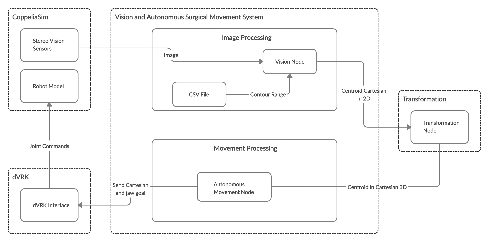

# Vision and Autonomous Surgical Movement
The repository contains algorithms in Python 2.0, split into two nodes. The vision node can recognize the object of interest using HSV values. The autonomous movement node can move the da Vinci surgical robot's PSM1 arm to the object of interest, pick up the object of interest, and move it to another location. The following diagram provides and overview of the system: 



The diagram is an overview including the transformation node which is not included in this repository. The transformation node will be located in a separate repository. The autonomous movement node included in this repository is dependent on the user to provide the direct cartesian coordinates of the object of interest. 

## Computer Pre-Check 
The following repository is dependent on components that only work on Ubuntu. If your machine is running on macOS, download [Virtual Machine](https://www.virtualbox.org/) and [Ubuntu](https://ubuntu.com/download/desktop). If the speed of Ubuntu is slow, you need to allocate more RAM. 

## Development Requirements
We use the catkin build tools, NOT catkin_make. Please don't use catkin_make.

#### DVRK Components 
1. Create and initialize catkin workspace named `dvrk_ws`.
```
mkdir -p ~/dvrk_ws/src
cd ~/dvrk_ws
catkin init
```
2. Download and compile the cisst libraries and SAW components for the dVRK, see the dVRK tutorial wiki: https://github.com/jhu-cisst/cisst/wiki/Compiling-cisst-and-SAW-with-CMake#13-building-using-catkin-build-tools-for-ros
3. Download and compile dvrk-ros: https://github.com/jhu-dvrk/sawIntuitiveResearchKit/wiki/CatkinBuild

ROS has multiple releases (Hydro, Indigo, Jade...). Use the Melodic release.  

#### OpenCV 
The vision node is dependent on the OpenCV (Open Source Computer Vision Library), an open source software library for computer vision and machine learning. 
1. Install OpenCV-Python in Ubuntu: https://docs.opencv.org/3.4/d2/de6/tutorial_py_setup_in_ubuntu.html

#### CoppeliaSim
1. Download [CoppeliaSim](https://coppeliarobotics.com/downloads). Use the edu version with full features. Extract and cd into the root CoppeliaSim folder. 
2. Copy the `libsimExtROSInterface.so` file from the `compiledRosPlugins` folder to the root CoppeliaSim Folder. 

This system uses `dVRK-training_pick&place.ttt` scene provided in [dvrk-vrep](https://github.com/unina-icaros/dvrk-vrep). The scene is readily available in CoppeliaSim. 

#### Vision and Autonomous Surgical Movement
1. Create and initialize a catkin workspace named `vis_and_auto_mov_ws`.
```
mkdir -p ~/vis_and_auto_mov_ws/src
cd ~/vis_and_auto_mov_ws
catkin init
```
2. Clone this repository into `vision_and_auto_mov_ws`.
```
cd ~/vis_and_auto_mov_ws/src
git clone https://github.com/EdwardKHKim/vision_and_autonomous_surgical_movement.git
catkin config --extend /path/to/dvrk_ws
```
3. Install dependencies.
```
cd ~/vis_and_auto_mov_ws
rosdep init
rosdep install --from-path src --ignore-src -r -y
```
4. Build packages.
```
catkin build
```

## Vision Node 
#### What does this node do?
The node is responsible for publishing Cartesian Coordinates in 2D of the centroid point of the object of interest.
#### Function specifications
- `__init__(self, hsv_ranges, desired_viewpoint)`: This function is to initiallize all the necessary variables for the class. 

- `PrepareImage(self, ros_image)`: This function is to prepare 

- `FindContours(self, hsv, lower_range, upper_range)`: This function is to draw a contour line around the object of interest. 

- `PublishPoints(self, frame, points, point_type)`: This function is to publish the Cartesian Coordinates in 2D as an output value. The output is shown in terminal. 

- `Centroids(self, ros_image, name)`: This function is to calculate the Cartesian Coordinates in 2D of the centroid points of the object of interest. We use the particular weighted average `moments` of the pixel intensities for the area bound by the countour lines to calculate the determine the centroid point. The OpenCV library includes the [moments function](https://docs.opencv.org/2.4/modules/imgproc/doc/structural_analysis_and_shape_descriptors.html?highlight=moments#moments). 

- `CSVToHSVRanges(features)`: This functions is to convert the values in the CSV file to the HSV value. The CSV file used in this class is `d`. The current values in the CSV file is set to recognize ranges that are shades of red, but other shades can be recognized by changing the ranges in the CSV file. 
#### Running Vision Node
The following are the steps to run the vision node in the system. A new terminal can be a new terminal tab or window.
1. In terminal, roscore can be launched using the roscore executable:
```
roscore
```
2. In a new terminal, launch CoppeliaSim
```
cd /path/to/coppeliasim/root
./coppeliaSim.sh 
```
3. Complete the following steps in CoppeliaSim: File &#8594; Open scene &#8594; `dvrk-vrep` &#8594; `V-REP_scenes` &#8594; `dVRK-training_pick&place.ttt`
4. Click Start/resume simulation.
5. In a new terminal, run `image_flipper.py` that converts the image messages to ROS conventions.
```
cd 
cd vis_and_auto_mov_ws
source devel/setup.bash
rosrun simulation image_flipper.py
```
6. In a new terminal, run the vision node 
```
cd 
cd vis_and_auto_mov_ws
source devel/setup.bash
rosrun featurization vision.py 
```
7. A new window will appear with an image feed that show a black contour line drawn on the object of interest and the centroid point of the object of interest as a black dot. The live feed of the Cartesian Coordinates in 2D of the centroid point can be seen in terminal.
## Autonomous Movement Node
#### What does this node do?
The node is responsible for automation of PSM1 movement to the object of interest, pick up the object of interest, and place it in another location using direct Cartesian Coordinates in 3D inputs.
#### Function specifications
- `configure(self, robot_name)`:

- `home(self)`:

- `cartesian_move(self, value_x, value_y, value_z)`:

- `open_jaw_ungrasp(self)`:

- `close_jaw_grasp(self)`:
#### Running Autonomous Movement Node
1. In terminal, roscore can be launched using the roscore executable:
```
roscore
```
2. In a new terminal, launch CoppeliaSim
```
cd /path/to/coppeliasim/root
./coppeliaSim.sh 
```
3. Complete the following steps in CoppeliaSim: File &#8594; Open scene &#8594; `dvrk-vrep` &#8594; `V-REP_scenes` &#8594; `dVRK-training_pick&place.ttt`
4. Click Start/resume simulation.
5. In a new terminal, run the dVRK console. 
```
cd
cd vis_and_auto_mov_ws
source devel/setup.bash
rosrun dvrk_robot dvrk_console_json -j console-PSM1_KIN_SIMULATED.json
```
6. The dVRK console will appear. Select _Direct Controle_. The arms can be set to any values using the _Desired position (deg)_ fields. For this system, leave the joint values as:
- _PSM1_: 0.0, 0.0, 0.0, 0.0, 0.0, 0.0, 0.0
7. In a new terminal, run `image_flipper.py` that converts the image messages to ROS conventions.
```
cd 
cd vis_and_auto_mov_ws
source devel/setup.bash
rosrun simulation image_flipper.py
```
8. In a new terminal, run the autonomous movement node.
```
cd
cd vis_and_auto_mov_ws
source devel/setup.bash
rosrun ecm_controller movement.py
```
9. In CoppeliaSim, the PSM1 arm will move to the object of interest. Grasp the object and let go of the object in another desired location. Sometimes, the object of interest will not be grasped. This seems to be an error in CoppeliaSim. However, at the minimum you can will be able to see the following movements in order: PSM1 moves to the first indicated Cartesian Coordinate &#8594; Open jaw &#8594; Close jaw &#8594; PSM1 moves to the second indicated Caresian Coordinate &#8594; Open jaw.

## Todo
- The autonomous movement node should subscribe to a transformation node that transforms the Cartesian Coordinates in 2D from the vision node to Cartesian Coordinates in 3D.

## Troubleshooting
- When using a code editor (Visual Studio Code, IntelliJ IDEA...), error messages in import statements can be ignored.
- If there are any questions or comments related to this repository, please contact me at edwardk.kim@hotmail.com.
